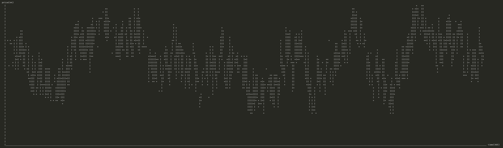

## Stock market

Script to generate stock market like graphs. The trends are produced by trader behavior and it has no external influences

### Assumptions

- There will be always NUMBER_OF_OFFERS sell orders
- There will be always NUMBER_OF_OFFERS buy orders
- First 10 buy orders are random between 4 and 25
- First 10 sell orders are random between 25 and 50
- If final exchange price last day was higher than the previous one, buy twice
- If final exchange price last day was lower than the previous one, sell twice
- Every time someone buys, a new selling offer is made, at a higher price than the new sell price
- Every time someone sells, a new buying offer is made, at a lower price than the new buy price

Example result:

